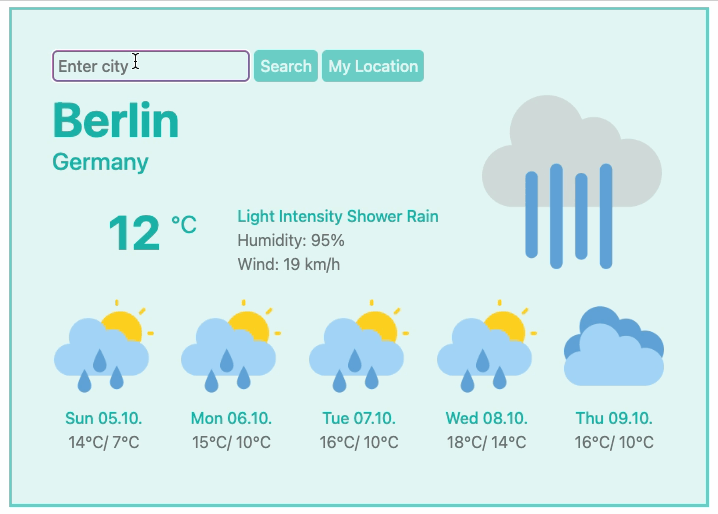

## 🌦️ Weather App

A simple and responsive Weather App for the browser, built with HTML, CSS, and JavaScript.

### ✨ About the Project

This project was developed as part of the [SheCodes](https://www.shecodes.io/) Web Development Course.
It uses an API provided by SheCodes to fetch real-time weather data and display it in a user-friendly interface.

#### Functionality

- Search location by city name or display data for the current location (default)
- Display the current temperature, humidity, wind and conditions
- Display the forecast for the next five days (min and max temperature and condition)

### 🛠️ Built With

- vHTML5
- CSS
- JavaScript
- SheCodes API
- Visual Studio Code

### 🌍 Deployment

The app is deployed with Netlify and can be viewed here:

👉 [Live Demo on Netlify](https://unique-yeot-45768b.netlify.app)

### 🎨 Credits

Weather icons created by [iconixar](https://www.flaticon.com/authors/iconixar) via [Flaticon](https://www.flaticon.com/)

### 💡 Future Improvements (optional)

- Add search suggestions and error handling
- Implement dark mode

### 👩‍💻 Author

Created with 💙 by Carla von Eicken
[LinkedIn](https://www.linkedin.com/in/carla-von-eicken/) | [GitHub](https://github.com/carla-voneicken)
